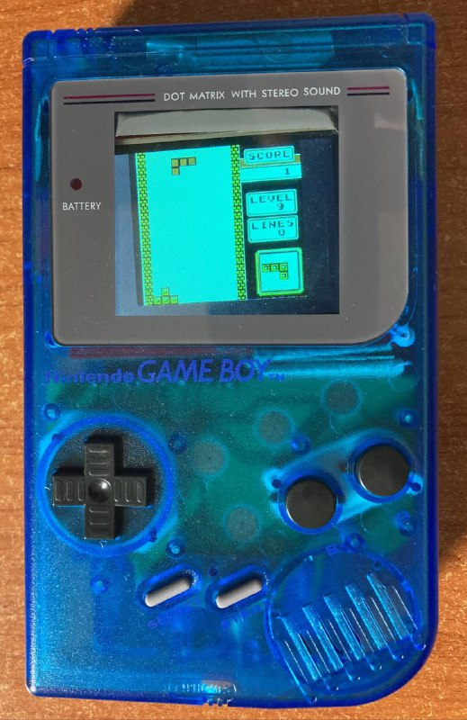

# STM32 GameBoy

**This project was built as a collaborative work by [Marco Cutecchia](https://github.com/mrkct) and [Edoardo Marangoni](https://github.com/eccma) for the course "Progettazione di Sistemi Operativi" at UNIMI.**

A project that aims to recreate a GameBoy by running an emulator on a STM32 board.

This is a port of an emulator to the STM32F411CEU6 microcontroller with the output sent to an ILI9341 display and taking inputs from a GameBoy Zero input PCB. Game ROMs are read from a microSD card on the side of the console. The whole console is powered by 3 AA batteries with a simple SPDT switch on the top.

The performances depend on the game: some simple ones such as Tetris easily manage over 55fps, while other games like Super Mario Land 2 are closer to 20fps. If you're interested in building something similar I would suggest you use a more powerful microcontroller.

A more detailed report(in Italian only) on the challenges of building this project can be found in [Docs/Report/report.pdf](Docs/Report/report.pdf).

Full wiring connections can be inferred from the following header file: [Core/Inc/config.h](Core/Inc/config.h).

## Acknowledgments

The emulator we have ported to the board is [peanutGB](https://github.com/deltabeard/Peanut-GB/).  
The FAT32 implementation comes from [FATFS](http://elm-chan.org/fsw/ff/00index_e.html).  
The microSD card driver comes from [cubeide-sd-card](https://github.com/kiwih/cubeide-sd-card).
